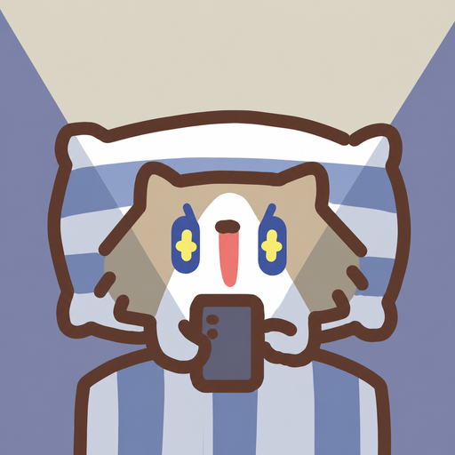
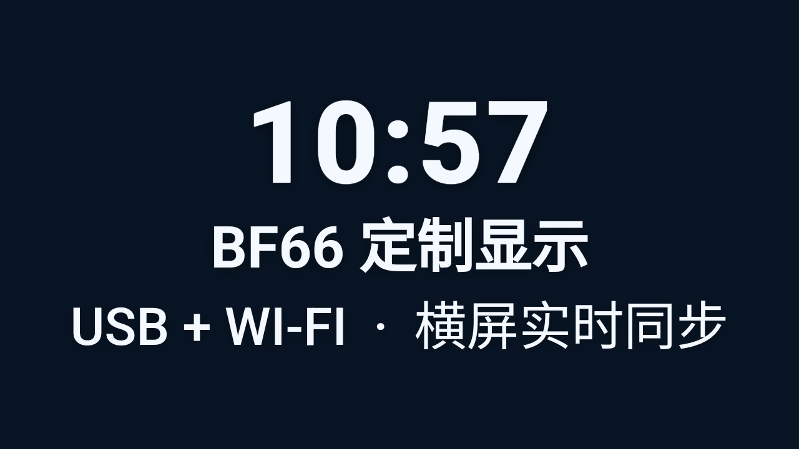
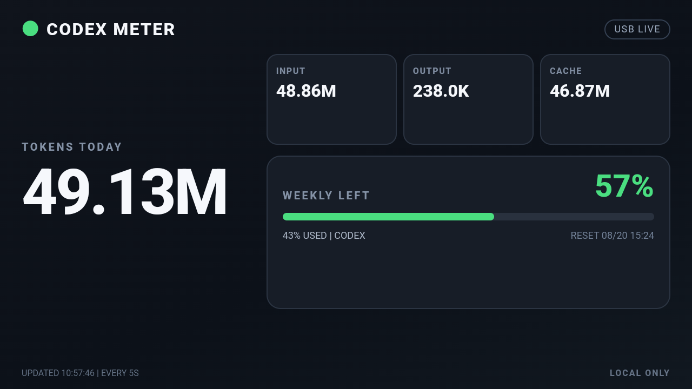
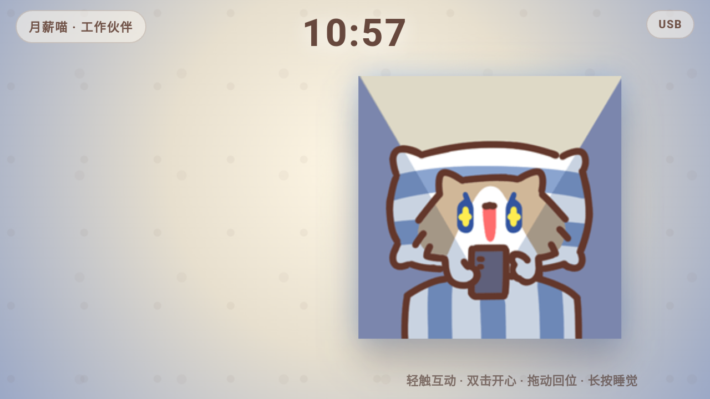
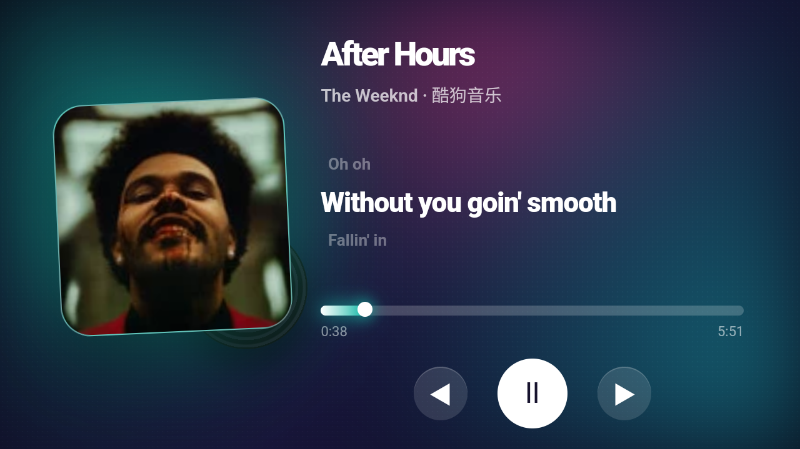

# BF66 Codex Display

<p align="center">
  
</p>

<p align="center">
  将梵沐 BF66（Android 13）变成由 Windows 控制的 USB / Wi-Fi 信息屏与互动桌宠。
</p>

<p align="center">
  <code>Windows</code> · <code>Android</code> · <code>USB</code> · <code>同一 Wi-Fi</code> · <code>横竖屏</code> · <code>本地优先</code>
</p>

> [!IMPORTANT]
> 这是我为自己的梵沐 BF66 制作的个人娱乐项目，主要用于尝试把闲置 MP4 改造成桌面信息屏。程序围绕这台设备的 Android 13 系统、720 × 1280 屏幕和触控表现进行设计，未对其他品牌或型号做兼容性保证；相近 Android 设备可以参考或自行适配，但不建议直接假定能够正常运行。

当前版本：2.4。

## 导航

- [四种显示模式](#四种显示模式)
- [快速开始](#快速开始)
- [月薪喵触屏互动](#月薪喵触屏互动)
- [USB 与 Wi-Fi](#usb-与-wi-fi)
- [从源码构建](#从源码构建)
- [隐私与安全](#隐私与安全)
- [来源与致谢](#来源与致谢)

## 四种显示模式

<table>
  <tr>
    <th width="50%">自定义画面</th>
    <th width="50%">GPT Usage</th>
  </tr>
  <tr>
    <td></td>
    <td></td>
  </tr>
  <tr>
    <td>文字、时钟、颜色和静态图片</td>
    <td>本地 Token 汇总与周额度</td>
  </tr>
  <tr>
    <th>月薪喵桌宠</th>
    <th>音乐播放器</th>
  </tr>
  <tr>
    <td></td>
    <td></td>
  </tr>
  <tr>
    <td>Codex 状态、时间和触屏动画</td>
    <td>酷狗歌曲信息、封面、同步歌词与播放控制</td>
  </tr>
</table>

四张图片均直接截取自 BF66 的 1280 × 720 横屏画面，不是电脑端模拟图。

### 自定义画面

- 设置标题、正文、字号、文字颜色和背景颜色。
- 支持 JPG、PNG、WebP、GIF、BMP。
- 图片可选择“完整显示”或“铺满裁剪”。
- 可显示当前时间，并自动适配横竖屏。

### GPT Usage

- 每约 5 秒读取电脑本地 Codex 用量记录。
- 展示今日 Token、INPUT、OUTPUT、CACHE、周剩余额度和重置时间。
- BF66 只接收计算后的统计摘要，不接收对话正文。

### 月薪喵桌宠

- 根据 Codex 最近活动自动进入工作、待机或睡觉状态。
- 有新任务时切换到处理任务动画；超过 10 分钟无新会话时休息。
- 横屏时气泡在左、月薪喵在右；竖屏时气泡位于时钟下方。
- 界面不显示绿色触控圆点，所有互动完全静音。

### 音乐播放器

- 仅在横屏模式下使用，读取 Windows 系统媒体会话中的酷狗播放信息。
- 实时显示歌曲名、歌手、专辑封面、播放进度、总时长和动态歌词。
- BF66 端支持上一首、播放/暂停、下一首以及拖动进度条。
- 可读取酷狗歌词目录中的 `.krc`、标准 `.lrc`，并在电脑端自动完成 KRC 解码与本地缓存。
- 超长歌词从左侧起点单向平移，在句尾停住；切换下一句时会先恢复到起点。

## 快速开始

1. 在 BF66 上开启“开发者选项”和“USB 调试”。
2. 准备 Android SDK Platform Tools，并将其放在控制端旁的 `tools/platform-tools`。
3. 构建并安装 `BF66Display.apk`，或在控制台中点击“安装显示端到 BF66”。
4. 用数据线连接并解锁 BF66，在设备上允许 USB 调试。
5. 启动 Windows 控制端；程序会自动连接、配对并打开 BF66 显示端。

更详细的操作和排错见 [使用指南](docs/使用指南.md)。

## 月薪喵触屏互动

| 操作 | 反馈 |
| --- | --- |
| 轻触头部 | 被抚摸动画与简短气泡 |
| 轻触身体 | 生气动画 |
| 双击 | 开心动画、跳跃和粒子 |
| 长按 | 睡觉 / 飘走动画 |
| 小范围拖动 | 跟随手指倾斜，松手后回到原位 |

桌宠模式同时显示当前时间。时间、气泡和角色分别位于独立安全区，不会互相遮挡。

## USB 与 Wi-Fi

连接优先级为 `USB > 同一 Wi-Fi`：

```text
Windows 控制端
  ├─ Codex 本地用量摘要
  ├─ 显示页面与状态接口（8787）
  └─ 随机配对密钥
        │
        ├─ USB：ADB reverse → 127.0.0.1:8787
        └─ Wi-Fi：可信局域网 → 电脑地址:8787
                                │
                           BF66 Android 显示端
```

首次使用必须通过 USB 完成一次配对。之后两台设备位于同一 Wi-Fi 时，拔掉 USB 也可以自动寻找控制端。

没有现成路由器时，也可以让已经联网的 Windows 电脑开启“移动热点”，再让 BF66 连接这个热点。这样电脑和 MP4 同样处于一个可通信的局域网中，控制端通常可以继续通过 Wi-Fi 传输画面；请将该热点网络设为可信的“专用网络”，并只为专用网络放行 Windows 防火墙。

## 从源码构建

### Windows 控制端

需要 .NET 8 SDK：

```powershell
dotnet publish pc/BF66Host/BF66Host.csproj `
  -c Release -r win-x64 --self-contained true `
  -p:PublishSingleFile=true `
  -p:IncludeNativeLibrariesForSelfExtract=true
```

发布时需要把 `Assets/Miao` 和 `THIRD_PARTY_NOTICES.md` 与控制端一起保留。

### Android 显示端

使用 Android Studio 打开 `android` 目录并构建 `app` 模块。当前配置：

- Android Gradle Plugin 8.9.2
- compileSdk / targetSdk 35
- minSdk 23
- versionName 2.4

### 重新生成图标

`tools/build_icons.py` 使用 Pillow 从一张正方形母图生成 Windows ICO、PC PNG 和 Android 各密度图标。

## 项目结构

```text
android/                 BF66 Android 显示端
pc/BF66Host/             Windows 控制端和月薪喵动画资源
docs/screenshots/        BF66 实机效果图
docs/使用指南.md          完整操作指引
docs/隐私与安全.md        数据与网络边界
tools/build_icons.py     图标生成工具
使用说明.txt              随程序提供的纯文本说明
```

## 隐私与安全

- 仓库不包含真实配对密钥、Codex 会话、设备序列号、用户名、绝对本机路径或调试日志。
- `bf66-connection.key` 仅在用户电脑首次运行时随机生成，并已加入 `.gitignore`。
- GPT Usage 只在电脑本机解析；BF66 不接收对话正文。
- Wi-Fi 通道使用随机配对密钥鉴权，但不是 HTTPS，因此只应在可信专用网络使用。

详细说明见 [隐私与安全](docs/隐私与安全.md)。

## 来源与致谢

“月薪喵”角色和 GIF 动画基于 GitHub 原作者 **sprmorn** 的 [DesktopPet-Miao](https://github.com/sprmorn/DesktopPet-Miao)。上游 README 声明项目采用 MIT License。

本项目保留来源与版本说明，并对布局、触屏操作、Codex 活动联动、横竖屏及 USB/Wi-Fi 通信进行了 BF66 专用适配。详见 [第三方说明](pc/BF66Host/THIRD_PARTY_NOTICES.md)。

BF66 Codex Display 是非官方个人项目，与 OpenAI、Codex、sprmorn 或设备厂商没有隶属或背书关系。相关名称、角色和标识的权利归其各自权利人所有。
